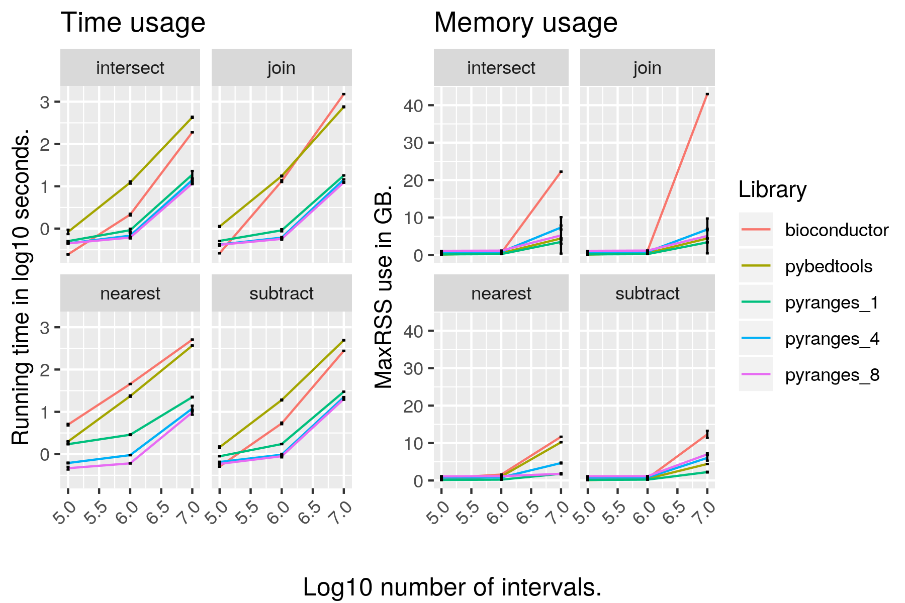

# pyranges

[](https://coveralls.io/github/biocore-ntnu/pyranges?branch=master) [](https://www.codacy.com/app/endrebak/pyranges?utm_source=github.com&amp;utm_medium=referral&amp;utm_content=biocore-ntnu/pyranges&amp;utm_campaign=Badge_Grade) [](https://travis-ci.org/biocore-ntnu/pyranges) [](http://hypothesis.readthedocs.io/) [](https://badge.fury.io/py/pyranges) [](https://opensource.org/licenses/MIT) 

## Introduction

GenomicRanges and genomic Rle-objects for Python.

*"Finally ... This was what Python badly needed for years."* - Heng Li

## Release

PyRanges is in a beta state. We are extremely responsive to bug-reports, so if you
have problems or come across unexpected behavior, please create an issue.

## Quick example

```python
import pyranges as pr
# load example datasets
exons, cpg = pr.data.exons(), pr.data.cpg()

# subsetting pyranges is easy
exons["chrY", "-",  15591259:27197945]
# +--------------|-----------|-----------|----------------------------------------|-----------|--------------+
# | Chromosome   | Start     | End       | Name                                   | Score     | Strand       |
# | (category)   | (int64)   | (int64)   | (object)                               | (int64)   | (category)   |
# |--------------|-----------|-----------|----------------------------------------|-----------|--------------|
# | chrY         | 15591393  | 15592550  | NR_047610_exon_27_0_chrY_15591394_r    | 0         | -            |
# | chrY         | 15591393  | 15592550  | NR_047607_exon_29_0_chrY_15591394_r    | 0         | -            |
# | chrY         | 15591393  | 15592550  | NM_001258269_exon_29_0_chrY_15591394_r | 0         | -            |
# | ...          | ...       | ...       | ...                                    | ...       | ...          |
# | chrY         | 26952215  | 26952307  | NM_020364_exon_16_0_chrY_26952216_r    | 0         | -            |
# | chrY         | 27197822  | 27197945  | NM_004678_exon_7_0_chrY_27197823_r     | 0         | -            |
# | chrY         | 27197822  | 27197945  | NM_001002760_exon_7_0_chrY_27197823_r  | 0         | -            |
# +--------------|-----------|-----------|----------------------------------------|-----------|--------------+
# PyRanges object has 22 sequences from 1 chromosomes.

# the API allows for easy and terse chaining
(cpg # use the cpg dataset
  .join(exons, suffix="_xn") # join with exons, use suffix _xn for duplicate cols
  .subset(lambda df: df.CpG > 30) # keep only rows with a CpG score over 30
  .sort() # sort on Chromosome, Start and End
  ["chrX"] # keep only chromosome X
  .assign("CpGDecile", lambda df: df.CpG / 10) # Insert new column
  .unstrand()) # remove the strand info
# +--------------|-----------|-----------|-----------|------------|-----------|-----------------------------------------|-----------|-------------+
# | Chromosome   | Start     | End       | CpG       | Start_xn   | End_xn    | Name                                    | Score     | CpGDecile   |
# | (category)   | (int64)   | (int64)   | (int64)   | (int64)    | (int64)   | (object)                                | (int64)   | (int64)     |
# |--------------|-----------|-----------|-----------|------------|-----------|-----------------------------------------|-----------|-------------|
# | chrX         | 584563    | 585326    | 66        | 585078     | 585337    | NM_000451_exon_0_0_chrX_585079_f        | 0         | 6           |
# | chrX         | 1510501   | 1511838   | 173       | 1510791    | 1511039   | NM_001636_exon_3_0_chrX_1510792_r       | 0         | 3           |
# | chrX         | 2846195   | 2847511   | 92        | 2847272    | 2847416   | NM_001669_exon_9_0_chrX_2847273_r       | 0         | 2           |
# | ...          | ...       | ...       | ...       | ...        | ...       | ...                                     | ...       | ...         |
# | chrX         | 153284685 | 153285655 | 94        | 153284647  | 153284779 | NM_001025243_exon_10_0_chrX_153284648_r | 0         | 4           |
# | chrX         | 153598874 | 153600604 | 164       | 153599240  | 153599729 | NM_001456_exon_45_0_chrX_153599241_r    | 0         | 4           |
# | chrX         | 153990840 | 153991831 | 105       | 153991030  | 153991256 | NM_001363_exon_0_0_chrX_153991031_f     | 0         | 5           |
# +--------------|-----------|-----------|-----------|------------|-----------|-----------------------------------------|-----------|-------------+
```

## Features

- fast
- memory-efficient
- featureful
- pythonic/pandastic
- supports chaining with a terse syntax
- uses Pandas DataFrames, so the whole Python data science stack works on PyRanges.

## Documentation

<https://biocore-ntnu.github.io/pyranges/>

(Might be slightly out of date; watch the CHANGELOG too)

## Install

```bash
pip install pyranges
```

## Paper/Cite

https://www.biorxiv.org/content/10.1101/609396v1

## TODO

For the future:

*   groupby
*   settings
*   write docstrings, autogenerate API-docs
*   K-nearest
*   write bam

Potentially:

*   support mixes of stranded and unstranded data

PyRanges should always be the fastest general-purpose genomics library for
Python. So I will happily change the multithreading library and overlap
datastructures sometime in the future, if rigorous tests show that the proposed
alternatives are indeed faster. (As the multithreading requires about 30 lines
of code and the overlap queries about 15, this will not be hard.)

## Performance



Comprehensive set of graphs for many types of functions on different datasets are here:

[Time](https://github.com/endrebak/pyranges-paper/blob/master/supplementary_paper/time.md)

[Memory](https://github.com/endrebak/pyranges-paper/blob/master/supplementary_paper/memory.md)

The exact code tested is found [here](https://github.com/endrebak/pyranges-paper/tree/master/supplementaries).
