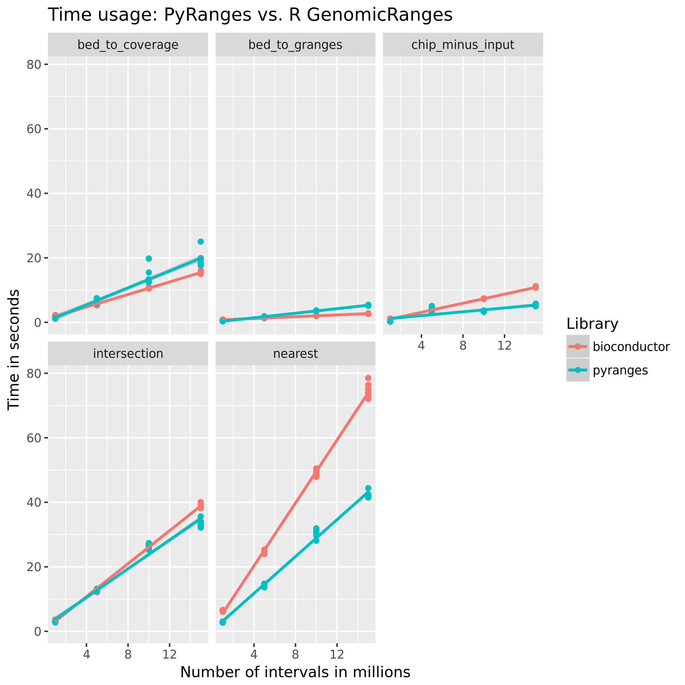
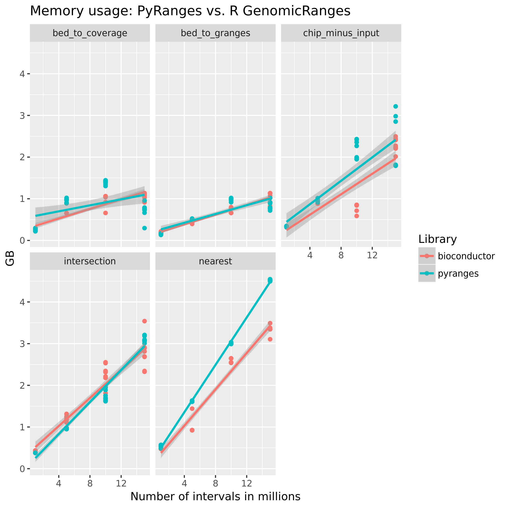

# pyranges

[](https://travis-ci.org/endrebak/pyranges) [](http://hypothesis.readthedocs.io/) [](https://badge.fury.io/py/pyranges)


## Release

PyRanges is slated for an early 2019 release, late February at the latest.

#### Introduction

GenomicRanges for Python.

This library is a thin, transparent wrapper around genomic data contained in
pandas dataframes. This allows for all the wonderful functionality of
bedtools/bedops and/or GenomicRanges, while being able to use the the enormous
universe of Python datascience libraries to manipulate and do computations on
the data.

PyRanges also contains a run-length encoding library for extremely efficient
arithmetic computation of scores associated with genomic intervals.

### Paper

Being written here: https://github.com/endrebak/pyranges-paper

### Documentation

https://endrebak.github.io/pyranges/

### Install

```bash
pip install pyranges
```

### TODO

For the future:

* Allow writing to different UCSC genome-browser compatible formats such as
  bigwig, bedgraph, histograms, colored bed etc
* Add visualization capabilites?
* Enable annotation with featurefetch?
* Add dtypes to PyRanges-header?
* Find sequences of ranges with pyfaidx
* Nearest: upstream/downstream
* K-nearest

### Performance




See how the timings are performed here:
https://github.com/endrebak/pyranges-paper I have tried to aggressively optimize
the R GenomicRanges runs for both time and memory.

### See also

* https://github.com/endrebak/pyrle
* https://github.com/vsbuffalo/BioRanges/tree/master/BioRanges
* https://github.com/daler/pybedtools
* http://bedtools.readthedocs.io/en/latest/
* https://github.com/phaverty/RLEVectors.jl
* https://bioconductor.org/packages/release/bioc/html/GenomicRanges.html
* https://bedops.readthedocs.io/en/latest/
